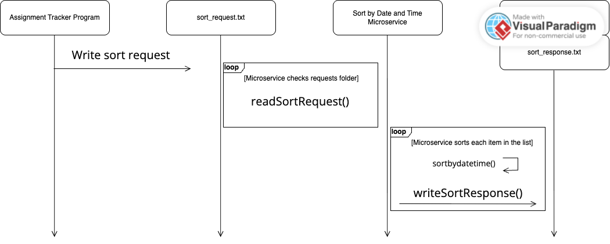

# Sort by Date and Time Microservice

## Description

The Sort by Date and Time Microservice is a microservice that creates a response text file containing a sorted list of items. The response file is placed into a shared response folder so the requesting program can read the sorted results. 

### How It Works:
The main programs requests data from the Sort by Date and Time Microservice by creating a text file containing the items and the “relevant_times” value. The file is placed into a shared request folder that the microservice checks. The microservice reads the request file, sorts the items in ascending order of day/time, and creates a response file with the sorted results.

## Communication Pipe

This microservice uses text files as the ocmmunication pipe. The requesting program writes a request text file into a shared `requests` folder. The microservice checks that folder, reads the request, processes the list by sorting, and writes a response text file into a shared `response` folder.
## How to Request Data

Create a text file named `sort_request.txt` inside the `requests` folder.

### Required parameters:
- `items`: the list of items that need to be sorted in ascending order of day/time.
- `relevant_times`: boolean value. If true, return dates and times that haven't already passed.

### Example Call:
`items = [[basketball, 5/16, 5pm], [volleyball, 5/14, 1pm], [spikeball, 5/15, 3pm]]`
`relevant_times = True`

## How to Receive Data

The microservice creates a response text file named `sort_response.txt` inside the `responses` folder.

Example response file:
`sorted_items = [[spikeball, 5/15, 3pm], [basketball, 5/16, 5pm]]`

## How To Run

Open two terminals from this folder.
Terminal 1:
`python sort_by_date_time_microservice.py`

Terminal 2:
`python program.py`

## UML Sequence Diagram

